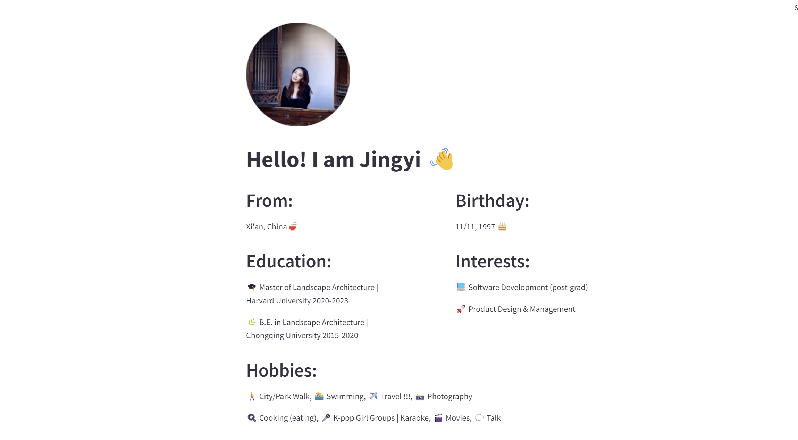

# TECHIN 510 Lab 1

My personal website for TECHIN 510 Lab1.

## What's Included

- `app.py`: The main Flask application
- `assets`: The images on the web application


# How to Run
### Option1:
- Pull this git repository and open it
- Open the ternimal and run the following commands to setup virtual env for streamlit and install the packages:
  ```
  python -m venv venv
  source venv/bin/activate
  pip install -r requirements.txt
  ```
- Then run this command to start the App:
  ```
  streamlit run app.py
  ```
  if cannot work, please try:
  ```
  python -m streamlit run app.py
  ```
### Option2:
Visit my personal webpage from this link:
https://jingyii.streamlit.app/

# Personal Webpage Overview


## What I Learned
- I learned about a very user-friendly web development tool, streamlit.
- How to us Python to build front-end and write front-end code.
